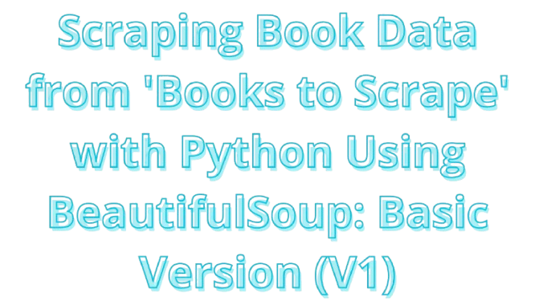

# 📘 Books to Scrape - Scraping Using BeautifulSoup: Basic Version (V1)

<div align="center">
   
</div>

</br>

[](LICENSE) [](https://www.python.org/) [](https://jupyter.org/)

This is a simple Python script to scrape book data from [Books to Scrape](https://books.toscrape.com/), a website that provides a collection of books. The scraper collects details about the **books, including titles, prices, ratings, availability, and cover image URLs**. It stores the data into a CSV file.

## 🚀 Features

- 📖 Scrapes book, such as titles, prices, ratings, availability, and cover image URLs.
- 📄 Supports scraping multiple pages.
- 💾 Saves the scraped data to a CSV file (`books_data.csv`).

## 🛠️ Technologies Used

[](https://docs.python-requests.org/)
[](https://www.crummy.com/software/BeautifulSoup/)
[](https://docs.python.org/3/library/csv.html)
[](https://docs.python.org/3/library/time.html)
[](https://pandas.pydata.org/)

## ⚙️ Installation

Follow these steps to get the project up and running:

1. **Clone the repository**:

   ```bash
   git clone https://github.com/RyanGA09/books-to-scrape-scraping-beautifulsoup-v1.git
   ```

2. **Navigate to the project directory**:

   ```bash
   cd books-to-scrape-scraping-beautifulsoup-v1
   ```

3. **Create a virtual environment**:

   ```bash
   python3 -m venv venv
   ```

4. **Activate Virtual Environment**:

   - On Linux/MacOS:

     ```bash
     source venv/bin/activate # On Linux
     ```

   - On Windows:

     ```bash
     venv\Scripts\activate # On Windows
     ```

5. **Install the required dependencies**:

   ```bash
   pip install -r requirements.txt
   ```

## 🧪 Usage

You can run the scraper using the Python script or interactively via Jupyter Notebook. The script will scrape book data and save it to a CSV file to the local machine.

Run the script to start scraping:

### 1. On Python

Run the script to start scraping book details:

```bash
python WebScraping.py
```

### 2. On Notebook

You can also run the script interactively via Jupyter Notebook for a more hands-on approach.

1. Start Jupyter Notebook

   ```bash
   jupyter notebook
   ```

   This will:

   - Scrape book details (title, price, rating, etc.) from the catalog.
   - Save the data to `books_data.csv` in the current directory.

2. Open `WebScrapingExperiment.ipynb` in the Jupyter interface and run the cells sequentially. This notebook allows for interactive scraping.

   This notebook allows you to run the scraping code in small chunks, which can be helpful for debugging and learning how scraping works step-by-step.

   **Note:**

   If you’re using Visual Studio Code (VSCode), PyCharm, or any other external IDE, you can open the Jupyter notebook file (WebScrapingExperiment.ipynb) directly inside your IDE and run the code without opening Jupyter through a browser.

## 🔍 How it Works

- scrape_books_from_page(url): This function is used to extract book data from a given web page (either the first page or other pages).
- scrape_multiple_pages(base_url, total_pages): This function sets the scraper to retrieve data from multiple pages (with pagination support) and merge all the results.
- save_to_csv(data, filename): This function is used to save the scraped data into a CSV file (books_data.csv), which facilitates further data analysis and processing.

## 📌 Explanation

- 📚 Supports Multiple Pages: In V1, this script already supports scraping of multiple pages. You only need to specify the number of pages you want to scrape in the `total_pages` variable in the script.
- ⏳ Using Wait Time: There is a `time.sleep(1)` in the script that pauses 1 second between each request to the server, to avoid overload and give the server time to respond.
- 📊 CSV File: The retrieved data will be saved in a CSV file named `books_data.csv`, which allows you to view and further analyze the data with spreadsheets such as Excel or Google Sheets.

## 📖 Read More

Check out my article on [Medium](https://medium.com/@ryangadingabdullah):

[](https://medium.com/@ryangadingabdullah/scraping-book-data-from-books-to-scrape-with-python-using-beautifulsoup-basic-version-v1-29eb974a2384)

## ☕ Support Me

This is a non-commercial project. If you find it useful and would like to support the development of this project, you can donate via the links below. Your support helps improve the project, but it does not grant any commercial rights over the project itself.

[](https://saweria.co/RyanGA09)

<!-- [](https://www.paypal.me/ryangading) -->

## 📜 License

This project is licensed under the `MIT License`. It is for **personal, academic, and non-commercial use only**. Any commercial use is prohibited without explicit written permission from the author.

See the [LICENSE](LICENSE) file for more details.

Copyright &copy; 2024 Ryan Gading Abdullah. All rights reserved.

## 📧 Contact

For commercial inquiries, please contact:

[](mailto:ryangadinga90@gmail.com)

Or reach me on LinkedIn:

[](https://www.linkedin.com/in/ryan-gading-abdullah/)
